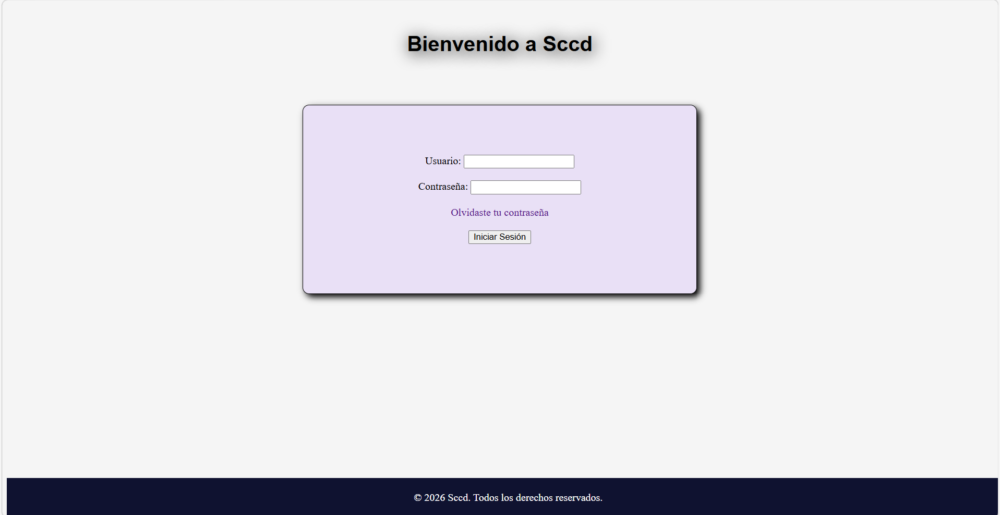
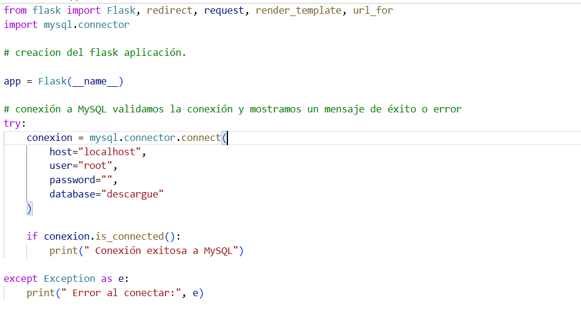
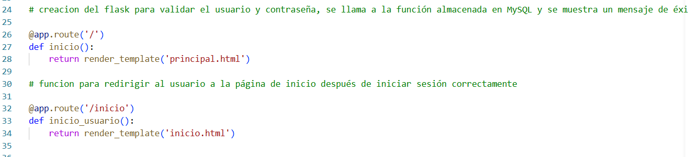
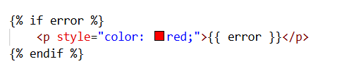

<h1 style= "color: blue"># Sistema de citas de cargue y descargue sccd</h1>

## Descripción
El sistema de asignación de citas de cargue y descargue es una aplicación desarrollada para el uso de pymes las cuales no cuenten con los suficientes recursos para la adquisición de un ERP (Enterprise resource planning) que tenga esta funcionalidad. El aplicativo surge para satisfacer la necesidad de controlar la logística al interior de las compañías, actividad que no se realiza en la mayoría de las pymes. El sistema deberá funcionar de manera local y en entorno web ya que interconectará compañías de trasporte con empresas de diferentes sectores. Esto permitirá el control de los tiempos de cargue y descargue de vehículos, así como brindar datos para su análisis.

## Tecnologias usadas
- Html
- CSS
- python
- Mysql

## Como Usarlo.

El aplicativo esta desarrollado para ser ejecutado en un entorno web. Donde el usuario debera acceder sus credenciales, de acuerdo al rol que desempeñe dentro del sistema. La  organización que adquiera el servicio recibira un usuario inicial con la cual podra ejecutar la confirguracion inciacial de los usuarios. Si por algun caso el usuario es bloqueado debera comunicarse por medio de correo electronico con la empresa con la cual contrato el servicio para que sea desbloqueado y actualizado su usuario. Es de aclarar que esto solo pasara con el usuario maestro. Los usuarios que se creen por el usuario maestro podran ser desbloqueados por dicho usuario.

## Pagina de inicio del programa.

## Codigo Html.

## Código CSS.

## CONEXION BASE DE DATOS CREACION DE SERVIDOR (flask python).

importamos la librearia flask y herramientas de esa libreria. Adicional la libreria para la conexion de la base de datos. establecemos la conexión con nuestra base de datos usando la contraseña y usuaio y nombre de la base de datos. 

 

## Render direccción a paginas html cuando son llamadas por el navegador.
en la primera llamada del navegador hace apertura o retorna la pagina principal de acceso por medio de la funcion inicio, y creamos la funcion inicio_usuario que retornara la pagina thml siguiente despues de que el usuario accesada con su ussuario y contraseña correspondientes.

## Funcion de login para validar datos de acceso.(python)

la primera parte del app.route recibimos el mensaje del navegador por medio del metodo post y como direccion /login capturamos los datos eenviados por el html.

por medio del metodo reques.form capturamos los datos enviados por el html y los alamcenamos en variables de python.

una vez echo esto creamos una variable cursor que nos permitira realizar consulta y almacenar los datos en una lista tipo diccionario conexion.cursor(diccionary=true).

Una vez echo esto realizamos la consulta a la base de datos por medio del procedimento creado que validar_usuario y enviamos los datos del html si estos se encuentran dentro de la base de datos retornara información la cual sera almacenda en una variable reultado la cual es un diccionario. 

los datos se traen con el metodo cursor.stored_results y la ejecutamos en un for donde la variable res va a contener caada uno de esos datos con res.fetchall se sacan esos datos y se alamcenan en la lista diccionario resultado. despues comparamos la varible resultado si esta contiene datos llamamos un metodo (redirect) y una funcion  que redireccionara la pagina al siguiente HTMl si no se enviara un mensaje al HTml principal indicando un error.

### Procedimiento BD.(mysql)

### Mensaje error.(html flask)

## validacion que archivo sea el principal.

Solo ejcuta el archivo conexion si es el principal si detectara que esta importado en otro archivo no lo correria y el app.run inicia la app, debug true permite que los cambios que yo realice se vean inmediatamente en el navegador.

